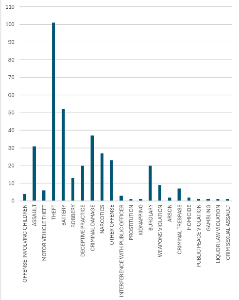

# 🕵️‍♂️ Crime Data Analysis Project – Chicago Crimes Dataset

## Overview

This project involved analyzing the Chicago Crimes dataset provided by the city of Chicago. Using various big data and geospatial techniques, I processed over 14 million crime records to perform spatial, temporal, and predictive analyses. The main goal was to demonstrate proficiency in data engineering, spatial joins, SQL queries, and machine learning using Spark and Beast.

---

## Objectives

- Translated high-level requirements into a scalable big data processing pipeline.
- Processed and enriched geospatial datasets using Spark and Beast.
- Performed spatial, temporal, and spatio-temporal analysis.
- Built a predictive model to forecast arrests based on crime descriptions.

---

## 📁 Task 1: Data Preparation

- Loaded and parsed crime CSV datasets using Spark DataFrames.
- Cleaned and renamed columns to ensure Parquet compatibility.
- Created geometry points for each crime using latitude and longitude.
- Performed a spatial join with ZIP code boundaries (from US Census Bureau) using Beast.
- Added a new `ZIPCode` column to each crime record based on spatial intersection.
- Wrote the final dataset in Parquet format as `Chicago_Crimes_ZIP`.

### ✅ Sample Output Schema

```
root
 |-- x: double
 |-- y: double
 |-- ID: integer
 |-- CaseNumber: string
 |-- Date: string
 |-- ...
 |-- ZIPCode: string
```

### 💡 Parquet Format Advantage

Using Parquet significantly reduced storage size and improved query performance due to its columnar structure and built-in compression. This made it efficient for both development and large-scale execution.

| Dataset     | CSV Size | Parquet Size |
|-------------|----------|--------------|
| 1,000       | 205 KB    | 213 KB        |
| 10,000      | 2 MB    | 1.2 MB        |
| 100,000     | 20.5    | 5.9 MB        |

---

## 🗺️ Task 2: Spatial Analysis

- Aggregated total number of crimes per ZIP code using SQL.
- Performed an equi-join with ZIP code geometries to prepare for visualization.
- Exported the aggregated result as a Shapefile `ZIPCodeCrimeCount`.
- Visualized the choropleth map in QGIS.

### 📍 Visualization

This choropleth map highlighted crime distribution across different ZIP codes, revealing hotspots and safer regions in Chicago based on the 10k dataset.


---

## 📊 Task 3: Temporal Analysis

- Parsed and filtered crimes between a given start and end date using SQL.
- Aggregated the number of crimes by `PrimaryType`.
- Output the results to a CSV `CrimeTypeCount`.
- Visualized the data using a bar chart (via spreadsheet tools).

### 📅 Timeframe Example

For the 10k dataset, this bar chart revealed common crime types during selected periods, such as high rates of **Theft** and **Assault**, with fewer cases of **Public Peace Violations**.

---

## 🧭 Task 4: Spatio-Temporal Analysis

- Filtered crimes based on both time range and rectangular spatial bounds.
- Output included all crime records matching these conditions.
- Wrote the filtered results to `RangeReportResult.csv`.

### 🖼️ Visualizations

I created visual plots using Python for Downtown Chicago regions and time ranges. Each region showed unique trends—some exhibited dense clusters of vandalism or burglary, while others showed seasonal or sparse patterns.


---

## 🤖 Task 5: Arrest Prediction

- Built a binary classification model to predict the `Arrest` status.
- Used only `PrimaryType` and `Description` as features.
- ML pipeline included:
  - **Tokenizer**
  - **HashingTF**
  - **StringIndexer**
  - **Logistic Regression**
- Split data into training and testing sets.
- Output included the original features along with `label` and `prediction`.

### 🧪 Evaluation

For both the 10k and 100k datasets, I computed:

| Dataset   | Precision | Recall | Time (s) |
|-----------|-----------|--------|----------|
| 10,000    | 87.14%    | 87.14% | 13.98       |
| 100,000   | 89.57%    | 64.74% | 17.72       |

While the model struggled with nuanced or ambiguous cases, it achieved reasonable accuracy in predicting arrests for clearer crime categories.

---

## Final Thoughts

This project combined geospatial computing, big data processing, SQL analytics, and machine learning in a real-world setting. It was a great exercise in managing complex data pipelines, leveraging cloud-scale frameworks, and visualizing results for impactful insights.

Contributors:
Kenny Thai, Peyton Chen, Matthew Tran, Syed Islam, Naquib Haque
